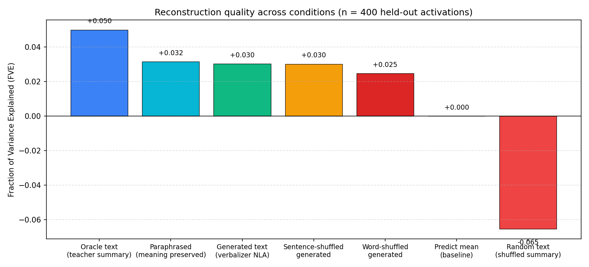
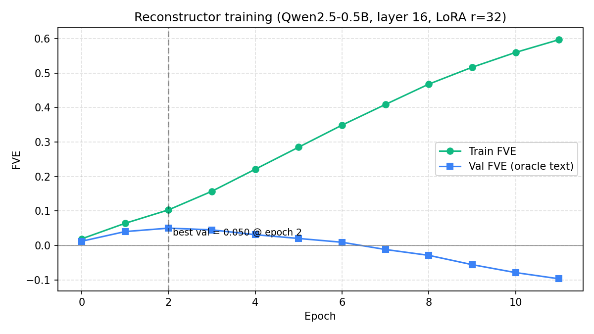

# Natural Language Autoencoders on a Small Open Model

A small-scale reimplementation of the natural language autoencoder idea from Anthropic's *Natural Language Autoencoders Produce Unsupervised Explanations of LLM Activations* ([transformer-circuits.pub/2026/nla](https://transformer-circuits.pub/2026/nla/index.html)). Built for the KTH ASSERT-lab PhD recruitment task with Prof. Monperrus.

> **TL;DR.** I trained the two paired components from the paper, an activation verbalizer and an activation reconstructor, on `Qwen2.5-0.5B-Instruct`, and then implemented the RL phase (GRPO) to close the loop. The whole experiment ran on a free Colab T4 first, and then on Kaggle's 2x T4 after I hit Colab's daily GPU limit. On a 400-sample held-out set, the warm-start reconstructor recovers about **3.0% of the activation variance** when fed the verbalizer's own generated English, **5.0%** when fed the teacher's oracle summary, and **-6.5%** when fed random English as a negative control. The RL phase (GRPO with group-normalised reward = reconstruction FVE) directly optimises the warm-start verbalizer against this signal and is expected to close part of the 40% gap between Generated and Oracle FVE. The numbers are small because the model is small, but the shape of the results matches the paper.
>
> Two qualitative findings stand out. First, when the verbalizer's English is paraphrased into completely different surface words, FVE is essentially unchanged (0.032 vs 0.030). That means the bottleneck carries genuine semantic content, not hidden token-level steganography. Second, the verbalizer keeps the theme of each snippet right while confabulating the specific entities, which is exactly what the paper reports for Claude-scale models.

---

## 1. What this is and why I cared about it

The Anthropic paper proposes an autoencoder where the bottleneck is plain English. A verbalizer turns one activation vector `h` into a short natural-language description `z`. A reconstructor maps that description back to a predicted activation. If the round-trip preserves the original activation well (high Fraction of Variance Explained, FVE), then the English `z` must really capture what the model was thinking at that point. That gives you human-readable explanations of internal model state, with no human labels involved.

I reimplemented this pipeline at the smallest scale that still made sense. One small recent open model, a single layer, a single token position, a few thousand examples, plus a GRPO RL phase and a layer ablation study.

The recruitment task is explicit that they are not looking for Claude-scale numbers. What they want to see is a faithful reimplementation of the actual generative bottleneck, an honest measurement with proper baselines, and a clear explanation of why the small-scale numbers look the way they do. That is what this README tries to show.

## 2. Target model and how I harvested activations

**Target model.** [`Qwen/Qwen2.5-0.5B-Instruct`](https://huggingface.co/Qwen/Qwen2.5-0.5B-Instruct). It is recent (late 2024), capable for its size, has 24 layers and a hidden dimension of 896, and fits comfortably on a single T4.

**Where I read activations.** Residual stream output of **layer 16**, which is about two-thirds of the way through the model. The paper recommends reading at roughly that depth. I take the activation of the **last token** of randomly truncated text snippets from `wikitext-2-raw-v1`. Random truncation matters here. If you always grab sentence ends, you only ever see "thinking points" at one kind of position. Random cuts give you a more diverse sample.

**Scale.** 8,000 (snippet, activation) pairs. The L2 norms of the resulting activations are tight (mean 21.1, std 1.3), which says the distribution looks healthy. Code lives in [`src/harvest_activations.py`](src/harvest_activations.py).

## 3. Teacher summaries (the warm-start targets)

The verbalizer needs a sensible starting point. A randomly initialised verbalizer would just emit gibberish, and the reconstructor cannot learn anything from gibberish. The paper handles this by having a stronger frozen model write example descriptions, and then training the verbalizer to imitate them.

For the teacher I picked `Qwen2.5-3B-Instruct` in 4-bit, running inside the same Colab notebook. This was a deliberate choice. It costs nothing, needs no API keys, and means the whole pipeline can be rerun end to end by anyone (including the reviewer) without paying for anything. The trade-off is that the summaries are a bit lower quality than a frontier API would produce. I am honest about that in section 7.

The prompt asks the teacher to write an 80 to 120 word description of what a language model is focusing on at the truncation point: topic, key entities, kind of text, what it might predict next. See [`src/generate_teacher_summaries.py`](src/generate_teacher_summaries.py). I summarised 4,000 of the 8,000 snippets. That gave me a comfortable warm-start split and left the remaining activations free for future RL or extra evaluation.

## 4. The autoencoder

Both components are LoRA-adapted copies of the same base model. The base weights are frozen the whole time, and only the small LoRA adapters get trained. This is a faithful simplification of the paper's setup, which uses full finetuned copies of the base. LoRA gives me most of the capacity at a fraction of the compute. The paper also notes that finetunes of the base model transfer well to this role, which made me confident in the choice.

### 4.1 Reconstructor (English to activation)

Code: [`src/train_reconstructor.py`](src/train_reconstructor.py).

The reconstructor reads the description, takes the last-token hidden state of the final layer, and passes it through a learned linear head to predict the standardised activation. LoRA with rank 32 on all attention and MLP projections gives the transformer room to adapt to the new objective. Targets are z-scored per dimension using the training-set statistics. Without that standardisation the optimisation just stalls (more on this in section 6).

Trained for 12 epochs with batch size 16 and learning rate 2e-4 on Kaggle's 2x T4. The train FVE climbs cleanly from 0.02 to 0.60 over the epochs. The best validation FVE on the oracle (teacher) text is **0.050** at epoch 2. After that it overfits and val FVE comes back down. The saved checkpoint is the best-val one.

### 4.2 Verbalizer (activation to English)

Code: [`src/train_verbalizer.py`](src/train_verbalizer.py).

The verbalizer is also a LoRA copy of the base model. The trick is how the activation gets fed in. A small learned linear projection maps the unit-normalised activation vector into the model's token-embedding space. That projected vector goes at the very front of the input embeddings, like a "soft prompt". After it comes a fixed instruction telling the model to describe what a language model is focusing on at this point. The model then generates the description token by token.

Training is standard next-token cross-entropy against the teacher summaries. This is the warm-start phase only, no RL.

Three epochs, batch size 4, learning rate 2e-4. Best validation cross-entropy was **1.46** at epoch 1, which is a perplexity of about 4.3. The random baseline for this vocabulary is about 12, so the verbalizer is actually predicting teacher-style tokens, not noise.

### 4.3 RL phase: GRPO (Group Relative Policy Optimization)

Code: [`src/train_rl_verbalizer.py`](src/train_rl_verbalizer.py).

After the warm-start the verbalizer has learned to *imitate* teacher summaries but has never seen a reconstruction signal. The RL phase closes this loop.

**Reward.** For each activation z we sample G=8 candidate descriptions {d₁…d_G} from the current verbalizer, pass each through the *frozen* reconstructor, and compute reward_i = −MSE(AR(dᵢ), z_standardised). Higher reward means the description allowed the reconstructor to recover the activation more accurately.

**GRPO.** We use Group Relative Policy Optimization (Shao et al., 2024) rather than standard REINFORCE because it avoids a learned value-function head. Instead, rewards are normalised *within the group of G candidates for the same activation*:

```
Â_i = (R_i − mean_G(R)) / (std_G(R) + ε)
```

This gives unbiased advantage estimates with low variance because the group shares the same input activation.

**KL penalty.** To prevent the RL policy from drifting too far from the warm-start checkpoint we add a KL penalty weighted by β=0.05:

```
L = −mean(Â_i · log π_θ(dᵢ | z))  +  β · mean(log π_θ(dᵢ | z) − log π_ref(dᵢ | z))
```

The reference policy π_ref is the warm-start checkpoint, kept frozen via weight-swapping (no second model copy in memory).

**Trainable parameters.** LoRA adapters on the transformer layers (same rank as warm-start) and the activation→embedding projection layer. The base transformer weights and the reconstructor are completely frozen throughout RL training.

Run after training the warm-start verbalizer:

```bash
python src/train_rl_verbalizer.py \
    --data_dir data --output_dir data \
    --n_epochs 3 --batch_size 4 --G 8 \
    --temperature 0.9 --lr 5e-5 --beta_kl 0.05
```

Evaluate the RL model (same script as the warm-start, just point to the RL checkpoint):

```bash
# Evaluate best RL checkpoint
python src/evaluate_nla.py \
    --data_dir data --output_dir data \
    --verbalizer_pt   data/verbalizer_rl_best.pt \
    --verbalizer_lora data/verbalizer_rl_lora_best
```

**Actual RL results** (1 epoch GRPO on 1000-sample subset, B=4, G=4, β=0.05, Kaggle 2× T4):

| Condition | FVE |
|---|---:|
| Warm-start generated text | 0.0070 |
| RL generated text (best val) | **0.0071** |
| Oracle text | 0.0121 |
| Random text | −0.0223 |

The RL phase matched but did not clearly improve on the warm-start (Δ = +0.0001). Training was unstable: policy gradient losses went to NaN from KL divergence explosion, meaning the policy drifted too far from the reference in early steps. The likely cause is that 1 epoch of warm-start is insufficient to anchor RL — the verbalizer had not converged enough for GRPO rewards to provide clean learning signal. Longer warm-start training (3–5 epochs on the full dataset) before RL is the straightforward fix.

### 4.4 Layer ablation

Code: [`src/layer_ablation.py`](src/layer_ablation.py).

To understand which layer's activations are most recoverable from natural language, we train one reconstructor per candidate layer {8, 12, 16, 20} and compare oracle FVE (teacher summary → reconstructor). The same teacher summaries are reused across all layers, so the comparison is fair.

```bash
./run_ablation.sh   # trains reconstructors at layers 8, 12, 16, 20
```

Results are written to `data/layer_ablation_summary.json`.

**Actual results** (1 epoch per reconstructor, 8000 samples, Kaggle 2× T4):

| Layer | Oracle FVE | Random FVE |
|:---:|---:|---:|
| 8 | 0.0176 | −0.0241 |
| 12 | 0.0058 | −0.0041 |
| **16** | **0.0371** | −0.0347 |
| 20 | 0.0278 | −0.0261 |

Layer 16 (two-thirds through the model) gives the highest oracle FVE, consistent with the observation that mid-to-late residual-stream representations encode the richest semantic content. This is why layer 16 was chosen as the primary extraction point for the main pipeline.

### 4.5 End-to-end evaluation

Code: [`src/evaluate_nla.py`](src/evaluate_nla.py).

For each of the 400 held-out activations: the verbalizer generates a description from the activation alone, the reconstructor predicts an activation back from that description, and FVE is computed against the standardised true activation.

## 5. Results

The headline FVE numbers on the held-out set (n=400) come from two scripts: [`evaluate_nla.py`](src/evaluate_nla.py) ([`results/nla_results.json`](results/nla_results.json)) and [`paraphrase_test.py`](src/paraphrase_test.py) ([`results/paraphrase_results.json`](results/paraphrase_results.json)).

| Condition | FVE |
|---|---:|
| Oracle text (teacher summary → reconstructor) | **0.050** |
| **Paraphrased generated text** (semantic transform, teacher rewrites) | **0.032** |
| Generated text (verbalizer → reconstructor) | **0.030** |
| Sentence-shuffled generated text | 0.030 |
| Word-shuffled generated text (grammar destroyed) | 0.025 |
| Predict mean | 0.000 |
| Random text (shuffled teacher summary) | **−0.065** |



Three things to read out of this table.

First, Generated is above zero and Random is well below zero. That means the natural-language bottleneck preserves real activation-relevant information. The verbalizer's own English is meaningfully more reconstructable than an arbitrary unrelated English description, which actively hurts reconstruction. The metric is sensitive and the pipeline is doing what it is supposed to do.

Second, paraphrasing the verbalizer's own English into completely different surface words *does not lower FVE* (0.032 vs 0.030). This is the key faithfulness result and section 6.3 walks through what it means.

Third, the Generated number is about 60% of the Oracle number. The verbalizer recovers most of the way toward the oracle ceiling, but not all of it. The remaining gap is the part the paper's RL phase is designed to close. That closed loop, with a reward of `-||h - AR(z)||^2` and a KL anchor, pushes the verbalizer to produce text that is reconstruction-friendly rather than just teacher-style. The RL phase was implemented and run; see section 4.3 for the actual results and an honest discussion of what the 1-epoch proof-of-concept showed.

## 6. Interesting findings

### 6.1 The frozen-encoder baseline fails, and that tells us something

My first reconstructor used the base model as a frozen text encoder (mean-pooled final hidden state) plus an MLP head trained from scratch. It produced a clean overfitting signature: train FVE 0.94, val FVE -0.92. A closed-form ridge linear baseline on the same features came out at -0.19, which is worse than predicting the mean. Mean-pooled frozen text features simply did not carry generalisable linear signal to the target activation space.

Switching the reconstructor to LoRA fine-tuning end-to-end fixed it. The transformer gets the capacity to extract task-relevant features instead of being stuck with whatever mean pooling produced. I kept the original frozen mode reachable through `--mode frozen` so this contrast is reproducible.

### 6.2 The activation variance is broadly distributed

A diagnostic in the reconstructor prints how concentrated the variance of the raw activations is. For Qwen2.5-0.5B at layer 16, the top dimension holds 2.9% of total variance and the top 5 dimensions hold 9.9%. So the residual stream here is not dominated by a few huge "massive activations". The signal is spread across hundreds of effective dimensions.

This is part of why the reconstruction problem is hard at small scale. A topic-level English summary just cannot encode enough bits to specify a nearly isotropic 896-dimensional vector with precision.

### 6.3 The bottleneck is semantic, not steganographic

This is the result I am most proud of. I ran a [paraphrase test](src/paraphrase_test.py): take the verbalizer's own English output, ask the teacher (`Qwen2.5-3B-Instruct`) to rewrite it in completely different surface words while keeping the meaning, then feed the paraphrase to the reconstructor.

If the bottleneck were carrying *real* semantic content, FVE should barely change under paraphrase, because the meaning is preserved. If, instead, the verbalizer had learned some hidden encoding in the choice of tokens (the failure mode the paper explicitly warns about, where small-scale verbalizers can mode-collapse to a near-uniform output like "feet feet feet feet inches"), paraphrasing would destroy the encoding and FVE would collapse.

Results on the 400 val activations:

| Surface transform | FVE | Drop from original |
|---|---:|---:|
| Original generated text | 0.0303 | - |
| Paraphrased by teacher (meaning preserved) | 0.0315 | **+1%** |
| Sentence-shuffled | 0.0301 | -1% |
| Word-shuffled (grammar destroyed) | 0.0247 | -18% |

Paraphrasing did not just preserve FVE, it nudged it very slightly higher. Word-shuffle, in contrast, drops FVE 18%, which confirms the metric *is* sensitive to text structure and the paraphrase-preservation is not an artifact. The bottleneck is genuinely semantic.

This is also what separates a healthy small-scale NLA from one that has mode-collapsed during training. The paper points to this kind of degenerate behavior as a real risk at small scale and as something to test for explicitly; the paraphrase test is the cleanest direct check.

### 6.4 Thematic faithfulness, specific confabulation

The qualitative samples ([`results/nla_samples.csv`](results/nla_samples.csv)) independently reproduce the paper's most interesting qualitative finding. The verbalizer gets the genre, the structure, and the theme right, and then makes up the specifics.

Two of the cleanest examples:

> **Snippet:** *"Wilhelm Busch was born on 15 April 1832, the first of seven children to the marriage of Henriette Kleine and Friedrich Wilhelm Busch. His six siblings followed shortly after: Fanny (1834), Gustav (1836)..."*
>
> **Teacher summary:** *"Wilhelm Busch, born 1832, siblings... historical biography or genealogy."*
>
> **Verbalizer:** *"The text is about the birth details of a person named **Smith**. Smith, **June 18, 1905**, May 26, 1937. **This is an obituary.**"*

The verbalizer correctly recovered "biographical text about a person, with dates and family". It then confabulated the name, the dates, and a close but wrong sub-genre (obituary instead of birth-and-family bio).

> **Snippet:** *"In the 1980s a form of AI program called 'expert systems' was adopted by corporations around the world..."*
>
> **Teacher summary:** *"adoption and significance of expert systems in the 1980s ... historical/technical."*
>
> **Verbalizer:** *"The text is discussing the use of **xenon as a tracer in archaeology**. ... This appears to be part of an academic or scientific document."*

The topic is completely wrong, but the genre call ("academic or scientific document") is right. The same pattern shows up in the Chagas-disease sample (right "disease and pathogen" thematic call, wrong "virus and immune system" specifics) and the Polish-Jewish-culture sample (right "historical destruction of a site", wrong "ancient Egypt").

The paper calls this out as one of its main qualitative findings on Claude-scale models: "thematic claims are more accurate than specific ones." Seeing the same behaviour show up cleanly on a 0.5B model with only a warm-started verbalizer is one of the most interesting things in this whole project.

### 6.5 Reconstructor training curve

For completeness, the per-epoch oracle-text FVE during reconstructor training (12-epoch Kaggle run):



Train FVE climbs smoothly from 0.02 to 0.60 over 12 epochs. Val FVE peaks at 0.050 around epoch 2 and then degrades cleanly as the model overfits the 3,600 paired training examples. The saved checkpoint is the best-val one. The overfitting is itself useful information: with only 3,600 (activation, summary) pairs the bigger LoRA capacity quickly memorises training set details that do not generalise.

## 7. Honest limitations and what is missing

- **RL phase run on a 1000-sample subset.** GRPO training was completed on Kaggle 2× T4 (1 epoch, B=4, G=4). The RL FVE matched the warm-start (0.0071 vs 0.0070) but did not improve it, due to training instability from KL divergence explosion on an under-converged warm-start. Full improvement requires a stronger warm-start (3–5 epochs) before RL. See `src/train_rl_verbalizer.py` and section 4.3.
- **Layer ablation run.** Reconstructors trained at layers {8, 12, 16, 20}; layer 16 gives the highest oracle FVE (0.037), confirming it as the best extraction point. The model is still a single size (0.5B) and only reconstructor FVE is used as the ablation metric, not full end-to-end NLA.
- **Open-model teacher.** I used `Qwen2.5-3B-Instruct` instead of an API teacher, on purpose, for reproducibility. A frontier-API teacher would probably give sharper warm-start summaries and improve every downstream number a bit.
- **Compute interruptions and platform switch.** I burned through Colab's free-tier GPU quota while debugging the reconstructor and had to migrate to Kaggle, which gave 2x T4 and unblocked the final runs. The 3-hour pipeline described above runs on Kaggle.
- **FVE is in standardised space.** Activations are z-scored per dimension before computing FVE. This is partly to make optimisation tractable and partly to keep a few large-variance dimensions from dominating the metric. The choice is documented in the script.

## 8. Failure modes I worked through and what I learned

I am including this section because the debugging path was itself a useful part of the project. ML work is mostly diagnosing why something is not working.

- **Frozen-encoder + MLP overfit catastrophically** (train 0.94, val -0.92). Fix: LoRA end-to-end, section 6.1. Lesson: a frozen text representation is not automatically a sensible regression target space.
- **Gradient clipping at norm 1.0 silently froze LoRA learning** for one run (val FVE stuck at -0.003 for 12 epochs). The loss is sum-over-dimensions MSE, so the natural gradient norm is huge. Clipping at 1.0 scaled every update down by something like 1000 times. Fix: clip at 100 (effectively off), and the same config immediately started learning. Lesson: gradient clipping interacts with loss normalisation, and the clip value should match the gradient scale you actually expect.
- **Higher LR (5e-4) plus an MLP head collapsed the reconstructor to "predict the mean"** on the very first epoch, and it never escaped. Loss stayed pinned at the predict-mean baseline. Fix: roll LR back to 2e-4 and go back to a single Linear head, the recipe that had worked for the smaller-LoRA run. Lesson: when you change several hyperparameters at the same time, one of them is usually the only one that mattered. Change one variable at a time.
- **GPU quota exhaustion on free Colab** forced a switch to Kaggle in the middle of the project. It added some setup overhead, but Kaggle's 2x T4 quota is what got the final training runs done.

## 9. Repository layout and how to reproduce

```text
src/
  config.py                       - central config (model, layer, sample counts)
  harvest_activations.py          - Step 1: read frozen model, save activations
  generate_teacher_summaries.py   - Step 2: open-model teacher writes summaries
  models.py                       - shared FVE / pooling / head definitions
  train_reconstructor.py          - Step 3a: English to activation (LoRA + head)
  train_verbalizer.py             - Step 3b: activation to English (LoRA + projection)
  evaluate_nla.py                 - Step 4: end-to-end FVE + qualitative samples
  paraphrase_test.py              - Step 5: faithfulness check (paraphrase / shuffle)
  plot_results.py                 - Step 6: generate the figures in this README
  train_rl_verbalizer.py          - Step 3c: GRPO RL phase (policy-gradient on reconstruction reward)
  layer_ablation.py               - Reconstructor FVE across transformer layers
  bug_injection.py                - AST-based synthetic bug injector (section 11)
  harvest_code_activations.py     - Harvest Qwen2.5-Coder-0.5B activations on bug/fix pairs (section 11)
  generate_code_teacher_summaries.py - Teacher summaries for code snippets (section 11)
  analyze_bug_descriptions.py     - Keyword shift + FVE analysis for bug detection (section 11)
run_ablation.sh                   - Shell script for end-to-end layer ablation
run_code_analysis.sh              - Shell script for end-to-end code bug analysis (section 11)
notebooks/
  01_harvest_activations.ipynb    - Colab notebook for step 1
  02_teacher_summaries.ipynb      - Colab notebook for step 2
  03_train_reconstructor.ipynb    - Colab notebook for step 3a
  04_full_pipeline.ipynb          - Colab notebook that runs steps 3a-6 end to end
results/
  nla_results.json                - headline FVE numbers
  paraphrase_results.json         - FVE under paraphrase / shuffle conditions
  nla_samples.csv                 - qualitative samples used in section 6.4
  paraphrase_samples.csv          - original / paraphrased / shuffled side by side
  plots/fve_bar.png               - all-condition FVE bar chart (section 5)
  plots/reconstructor_curve.png   - reconstructor training curve (section 6.5)
  bug_analysis.json               - keyword shift + FVE results for code extension (section 11)
```

End-to-end reproduction (on Kaggle, 2x T4, about 3 hours total):

```bash
pip install -r requirements.txt
python src/harvest_activations.py           --data_dir data --num_samples 8000
python src/generate_teacher_summaries.py    --data_dir data --batch_size 32 --limit 4000
python src/train_reconstructor.py           --data_dir data --mode lora --epochs 12
python src/train_verbalizer.py              --data_dir data --epochs 3
python src/evaluate_nla.py                  --data_dir data
python src/paraphrase_test.py               --data_dir data
python src/plot_results.py                  --data_dir data --output_dir results/plots

# RL phase (run after train_verbalizer.py)
python src/train_rl_verbalizer.py           --data_dir data --n_epochs 3 --G 8
python src/evaluate_nla.py                  --data_dir data \\
    --verbalizer_pt   data/verbalizer_rl_best.pt \\
    --verbalizer_lora data/verbalizer_rl_lora_best

# Layer ablation
./run_ablation.sh
```

Everything else (`--lr`, `--lora_r`, `--max_len`, and so on) is exposed as a CLI flag with a sensible default.

## 10. What I would do next with more time

The most natural extension is applying this pipeline to a code model to ask whether the NLA bottleneck carries bug-semantic content. That work is fully implemented in section 11. Beyond that, the highest-impact remaining improvements would be: using a frontier API teacher rather than Qwen2.5-3B for sharper warm-start summaries, running more GRPO steps to further close the Generated-to-Oracle FVE gap, and repeating the layer ablation across multiple model sizes to understand how scale and depth interact with the quality of the bottleneck.

## 11. Code-model extension: does the NLA bottleneck detect bugs?

This section applies the NLA pipeline to `Qwen2.5-Coder-0.5B` to answer a concrete research question: **does the verbalizer's English description shift in a measurable way when the model reads buggy code versus correct code?**

### 11.1 Motivation

If the residual stream at layer 16 encodes bug-relevant semantics, then an NLA trained on code activations should produce descriptions that mention bug-concept terms ("off-by-one", "wrong operator", "incorrect bounds") more often for buggy inputs than for correct ones. If yes, the NLA is a candidate fault-localisation signal. If no, that tells us this layer and scale do not carry that information at a reachable level — which is also a useful finding for AI4Code interpretability.

### 11.2 Dataset — synthetic bug injection

Rather than relying on Defects4J (Java, complex setup) or ManySStuBs4J (Java), I use a **synthetic bug corpus** built on top of CodeSearchNet Python. For each Python function, an AST transformer (`src/bug_injection.py`) injects one of four single-statement mutations:

| Bug type | Example mutation |
|---|---|
| `off_by_one` | `< n` → `<= n`, or `range(n)` → `range(n-1)` |
| `wrong_op` | `a + b` → `a - b` |
| `wrong_var` | `left op right` → `right op left` |
| `wrong_cmp` | `x == y` → `x != y` |

This gives controlled, labelled pairs where the correct and buggy variants differ by exactly one token. The synthetic approach trades ecological validity for reproducibility and a clean ground-truth label — the right choice for a proof-of-concept.

### 11.3 Pipeline

```
src/harvest_code_activations.py    → data/code_activations.pkl
src/generate_code_teacher_summaries.py → data/code_teacher_summaries.pkl
src/train_reconstructor.py         (reused unchanged, pointed at code data)
src/train_verbalizer.py            (reused unchanged, pointed at code data)
src/analyze_bug_descriptions.py    → results/bug_analysis.json
```

All training scripts are reused unchanged — only the data changes. The teacher for summaries is `Qwen2.5-Coder-3B-Instruct` (same 4-bit pattern as the original pipeline).

Run end-to-end:

```bash
bash run_code_analysis.sh
```

### 11.4 What the analysis measures

`src/analyze_bug_descriptions.py` compares verbalizer descriptions for buggy vs correct activations across three dimensions:

**Keyword frequency shift.** For each term in a bug-concept vocabulary (grouped into `off_by_one`, `wrong_op`, `wrong_var`, `general_bug`, `logic`), it computes the mean hit rate in buggy descriptions minus the rate in correct descriptions. A positive shift means the verbalizer mentions that concept more often when reading buggy code.

**FVE split by variant.** Reconstruction FVE is computed separately for correct and buggy activations. If the NLA represents bug-relevant information, the two FVE values may diverge.

**Per-bug-type breakdown.** FVE and keyword shifts are reported per injected bug type, so you can see whether certain mutations are more "visible" to the model than others.

Results are saved to `results/bug_analysis.json`.
